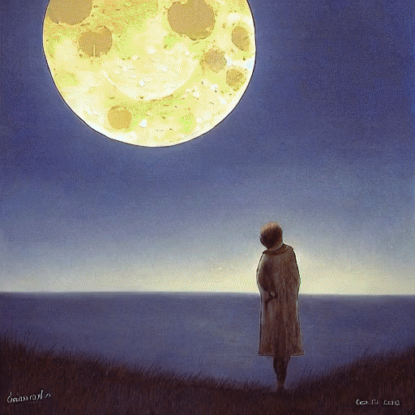

# Image Morphing Using Diffusers from Textual Descriptions
Prompt and image interpolation using Diffusers to create smooth animations from a text.

The pipeline blends both the **text prompts** and the **images** to produce a coherent morphing effect, creating an artistic video that evolves from one verse to the next.

---

## Project Structure  
- **`text_to_animation.ipynb`**: a notebook to generate the full video from a list of textual prompts  
- **`exemple.mp4`** : an exemple of what this notebook can produce 

---

## Technologies Used  
- **Python 3.11**
- **diffusers** (`StableDiffusionImg2ImgPipeline`)
- **MoviePy**
- **Pillow**
- **NumPy**
- **TQDM**

---

## How to Run  
1. Open the notebook in [Google Colab](https://colab.research.google.com)
2. Define your text (for exemple here a poem) :
```bash
poem = [
    "Under the glow of a lonely moon,"
     "Trees dance to the rhythm of the wind.",
     "The sun shines in my life,",
     "And yet I walk in the rain,",
     "rain that saws me, bends me, empties me,",
     "humic weather that tires and wrinkles me."
]
```
3. The notebook will:
   - Generate an image for each line
   - Create interpolations between each using line using blending + `img2img`
   - Export a final video: `video.mp4`

---

## Example Output  

